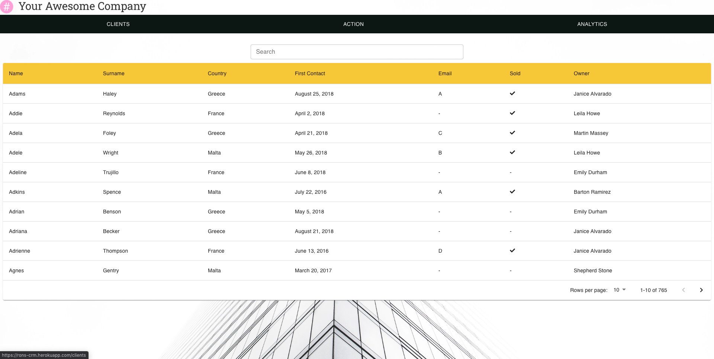
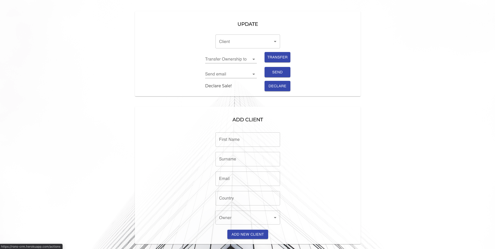
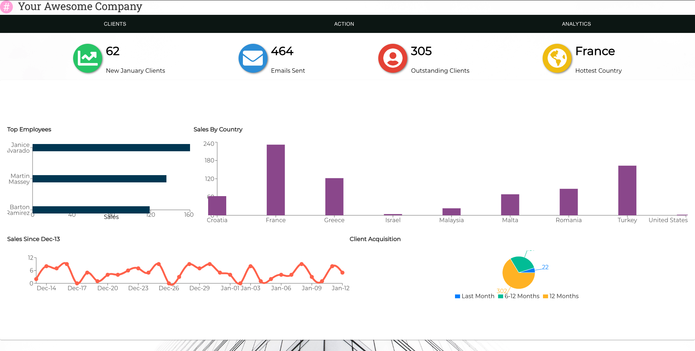

# CRM

CRM is a Client Relationship Management system built with React. It includes a graphic analytics dashboard for company reports.

Demo: https://rons-crm.herokuapp.com/

## Table Of Contents
- [CRM](#crm)
  - [Table Of Contents](#table-of-contents)
  - [Screenshots](#screenshots)
    - [Client List](#client-list)
    - [Add or Update Client](#add-or-update-client)
    - [Analytics Dashboard](#analytics-dashboard)
  - [Tech-stack](#tech-stack)

## Screenshots

### Client List
An overview of all your clients. You can search clients by name.

### Add or Update Client
Fill out the inputs and then click *add* or *update* to add a new client. When adding/updating a snackbar will popup to confirm success.

### Analytics Dashboard
View a report of all the metrics regarding your clients.

## Tech-stack
1. React, Recharts, Material-UI, Axios and MobX.
2. Express (Node.js), Sequelize (MySQL).